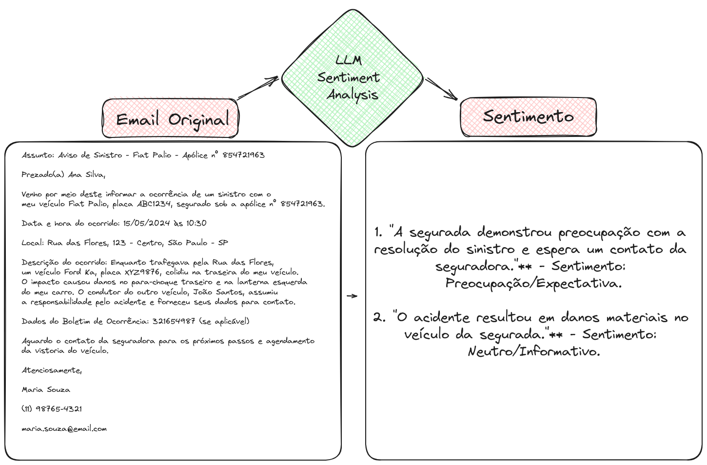

# Workshop - Processamento de Sinistros de Seguros

## Visão Geral do Workshop


Este laboratório demonstrará como a combinação de diversas tecnologias de Inteligência Artificial/Aprendizado de Máquina (IA/ML) pode gerar uma solução valiosa para um problema de negócio. As informações, códigos, modelos e técnicas apresentados ilustram como um primeiro protótipo poderia ser desenvolvido, e não representam a única forma de atender aos requisitos estabelecidos.

Além do treinamento feito para a análise dos sinistros, como parte do Workshop no TDC Florianópolis, o exemplo foi adaptado para utilizar o **Skupper** como a conexão dos dados privados dos pedidos de seguros. Com isso, a solução será implementada da seguinte forma:

1. O armazenamento dos dados brutos dos pedidos será feito dentro da empresa, mantendo o sigilo e controle dos dados.
2. Uma aplicação Go vai expor os dados internamente em um container podman com um endpoint para a conexão com o Skupper. [go-flp](https://github.com/rafaelvzago/go-flp)
3. O ambiente para treinamento dos modelos de IA/ML será feito em um cluster Openshift AI na AWS.
4. A conexão do serviço de exposição de dados podman com o ambiente em nuvem do Openshift AI será feita com o Red Hat Service Interconnect (Skupper), que é uma plataforma de integração de aplicativos híbridos e multicloud que permite conectar aplicativos e dados em qualquer ambiente, seja local, em nuvem ou em contêineres.

Ao utilizar o Skupper, garantimos uma conexão segura e eficiente entre os dados locais e os serviços de IA/ML em nuvem, facilitando a criação de soluções híbridas robustas e escaláveis.

Detalhes:

1. Esse workshop se baseia em uma demonstração do OpenShift AI, que fornece um ambiente de trabalho completo para desenvolvimento de projetos de IA/ML.
2. Repositório do projeto: [Insurance Claim Processing](https://github.com/rh-aiservices-bu/insurance-claim-processing/tree/main)
3. Red Hat Service Interconnect: [Red Hat Service Interconnect](https://www.redhat.com/en/technologies/cloud-computing/service-interconnect)
4. Skupper: [Skupper](https://skupper.io/)
5. Go-flp: [go-flp](https://github.com/rafaelvzago/go-flp)

---

## O papel do Skupper

O Skupper é uma plataforma de integração de aplicativos híbridos e multicloud que permite conectar aplicativos e dados em qualquer ambiente, seja local, em nuvem ou em contêineres. Ele fornece uma maneira segura e eficiente de conectar serviços e aplicativos em diferentes ambientes, permitindo a comunicação entre eles de forma transparente e escalável.

Neste workshop, o Skupper é utilizado para conectar um serviço de dados local, que contém informações sensíveis sobre pedidos de seguros, com um ambiente de IA/ML em nuvem, onde os modelos de processamento de sinistros são treinados e executados. Essa conexão segura e eficiente permite que os dados sejam acessados e processados de forma remota, mantendo a integridade e a segurança das informações.

### Detalhes

- Segurança: Para garantir a segurança dos dados, o Skupper utiliza criptografia de ponta a ponta e autenticação baseada em certificados para proteger a comunicação entre os serviços. (mTLS)
- Conectividade: O Site mais aberto (Openshift AI) é quem oferece o serviço de entrada para a VAN, e o site mais fechado (podman) é quem se conecta a VAN.

## Estrutura do Processo

* Contexto
* Conexão e Setup
* LLM para Resumo de Texto
* LLM para Extração de Informações
* LLM para Análise de Sentimento

## Cenário

Somos uma grande seguradora multinacional em processo de transformação digital, buscando modernizar práticas e utilizar novas tecnologias. Uma pequena equipe foi incumbida de analisar o processo atual de sinistros e propor melhorias.

As descobertas serão apresentadas à diretoria e, se convincentes, a equipe receberá recursos para implementar as recomendações. As próximas seções deste capítulo apresentam os materiais que foram apresentados à diretoria.

Temos a necessidade de integrar a solução de processamento de sinistros com análise de texto com nossa API em um cluster Kubernetes na AWS, pois o processamento foi feito dentro de outro datacenter da empresa.

## Desafios:

### Uso do Skupper para Garantir a Segurança e Integridade dos Dados

1. **Manter a integridade dos dados e a segurança da informação**:
   O Skupper permite criar redes de aplicações híbridas e multicloud, garantindo que a comunicação entre diferentes ambientes seja segura e confiável. Utilizando o Skupper, é possível criptografar todo o tráfego de dados, assegurando que os dados sensíveis estejam protegidos durante a transmissão. Além disso, ele mantém a integridade dos dados, evitando alterações não autorizadas e garantindo que os dados recebidos sejam os mesmos que os enviados.

2. **Processamento dos e-mails com OpenShift AI no datacenter localizado dentro da empresa**:
   Para o processamento de e-mails, o Skupper pode ser configurado para conectar a infraestrutura interna da empresa com o cluster OpenShift AI no datacenter local. Isso permite que os modelos de IA/ML sejam treinados e executados localmente, mantendo o processamento perto da origem dos dados e reduzindo a latência. Com o Skupper, a empresa pode utilizar as capacidades avançadas do OpenShift AI sem expor os dados sensíveis à nuvem pública.

3. **Manter a aplicação contendo os dados sensíveis, como os claims originais, dentro da empresa**:
   A aplicação que armazena dados sensíveis, como os claims originais, deve permanecer dentro da infraestrutura da empresa para garantir a segurança e conformidade com as políticas internas de proteção de dados. O Skupper facilita a conexão segura dessa aplicação com outros serviços ou ambientes de processamento, garantindo que os dados não precisem ser movidos para fora da empresa.

4. **Garantir a conexão segura entre o serviço de dados e o datacenter**:
   O Skupper usa túneis de comunicação seguros para conectar diferentes ambientes, seja no local, na nuvem ou em contêineres. Isso assegura que a conexão entre o serviço de dados (armazenado dentro da empresa) e o datacenter (onde o OpenShift AI está localizado) seja robusta e protegida contra interceptações ou acessos não autorizados. O uso de Skupper proporciona uma comunicação segura e eficiente, essencial para manter a confidencialidade e integridade dos dados sensíveis.

Em resumo, o Skupper é uma ferramenta crucial para garantir que os dados sensíveis sejam transmitidos e processados de forma segura entre diferentes ambientes, mantendo a integridade e segurança das informações. Ele possibilita a implementação de soluções híbridas que combinam a infraestrutura local e a nuvem, aproveitando o melhor dos dois mundos sem comprometer a segurança dos dados.

---
## Exemplos do Trabalho de Prototipagem

Os exemplos abaixo ilustram o que esperamos alcançar com a versão protótipo do processo aprimorado.

### Utilizando um LLM para Resumo de Texto

Permite uma leitura mais rápida pelo perito.


 A imagem demonstra como um modelo de linguagem (LLM) pode resumir um e-mail longo e confuso de um cliente sobre um acidente de carro em um formato claro e conciso. Isso permite que o perito de seguros compreenda rapidamente os detalhes-chave do acidente (data, local, danos, testemunhas), agilizando o processo de análise e processamento da reivindicação.

### Utilizando um LLM para extração de informações

Permite extrair informações-chave de um e-mail e preencher automaticamente.


A imagem demonstra como um modelo de linguagem (LLM) pode extrair informações-chave de um e-mail sobre um acidente de carro e preencher automaticamente um formulário estruturado. No exemplo, o LLM extraiu corretamente a data do acidente, local, tipo de sinistro e modelo do carro do remetente, economizando tempo e reduzindo o risco de erros manuais no cadastro da ocorrência.

## Exemplos do Trabalho de Prototipagem (Continuação)

### Utilizando um LLM para Análise de Sentimento

Permite identificar rapidamente o sentimento do cliente.



Detectar o tom do texto e potencialmente agir sobre ele.


## Como usar LLMs?

- [Notebook para utilizar LLM](https://github.com/rh-aiservices-bu/insurance-claim-processing/blob/main/lab-materials/03/03-01-nb-llm-example.ipynb)

Este notebook demonstra a interação programática com um modelo de linguagem de grande porte (LLM), como o ChatGPT, usando Python e o framework Langchain. Através da API do modelo Mistral-7B Instruct v2, configuramos parâmetros e definimos um template para guiar as respostas do modelo. Combinando o modelo e o template no Langchain, criamos um objeto de conversa para facilitar a comunicação com o LLM, exemplificado por uma pergunta sobre Inteligência Artificial. Este método programático de interação com LLMs oferece oportunidades para integrar modelos de linguagem em aplicações e sistemas, permitindo o desenvolvimento de soluções mais personalizadas e eficientes.

### Notebook para Resumo de Texto

- [Notebook para resumir texto com LLM](https://github.com/rh-aiservices-bu/insurance-claim-processing/blob/main/lab-materials/03/03-02-summarization.ipynb)

O código Python em questão prepara dados de sinistros de seguro para sumarização por um modelo de linguagem (LLM). Ele lê arquivos JSON na pasta 'claims', converte o conteúdo em dicionários Python e armazena em um dicionário maior claims. Utiliza o framework Langchain para criar um pipeline de sumarização com o modelo de linguagem Mistral-7B Instruct v2 e um template específico. Após a criação do pipeline, o código itera sobre cada sinistro em claims, exibindo o assunto e o conteúdo original do sinistro, seguido do resumo gerado pelo LLM, permitindo a avaliação da qualidade e utilidade da sumarização do modelo.


### Notebook para Extração de Informações

- [Notebook para extrair informações com LLM](https://github.com/rh-aiservices-bu/insurance-claim-processing/blob/main/lab-materials/03/03-03-information-extraction.ipynb)

Este notebook utiliza o framework Langchain e o modelo de linguagem Mistral-7B Instruct v2 para analisar textos e extrair informações específicas, como o sentimento do autor e detalhes de um evento. Um pipeline de análise é criado com um template específico para guiar o LLM. O código lê arquivos JSON de sinistros de seguro e, para cada um, exibe o assunto e o conteúdo original, realiza consultas ao LLM para análise de sentimento, extração de local e tempo, e apresenta os resultados da análise.

### Notebook para comparação de modelos de LLMs

- [Notebook para comparar modelos de LLMs](https://github.com/rh-aiservices-bu/insurance-claim-processing/blob/main/lab-materials/03/03-04-comparing-models.ipynb)

Este notebook compara dois modelos de linguagem (LLMs): Mistral-7B e Flan-T5-Small, avaliando seu desempenho em tarefas de análise de texto, como identificar o sentimento do autor, local e horário de um evento. O Mistral-7B, com 7 bilhões de parâmetros, exige uma GPU com 24GB de RAM e oferece resultados mais precisos e detalhados. Em contraste, o Flan-T5-Small, com 80 milhões de parâmetros, pode ser executado sem GPU e com apenas 1GB de RAM, sendo mais rápido, porém menos preciso.

Na análise de um sinistro de carro, o Mistral-7B identificou corretamente o sentimento positivo, o local exato (cruzamento de Birch Street e Willow Avenue em Evergreen) e o horário (2 de janeiro de 2024, às 15h30). Já o Flan-T5-Small apresentou resultados imprecisos, como um sentimento negativo e informações incorretas sobre o local e o horário. A escolha do modelo ideal deve equilibrar desempenho, precisão e recursos disponíveis, com verificações de sanidade essenciais para garantir que o modelo atenda às expectativas e se adapte a mudanças nos dados.

## Parte 2: Hands On

### Atividades


0. Instalar o binário do Skupper
1. Instalar o Skupper localmente
2. Instalar o Skupper no Cluster OpenShift
3. Fazer o link dos sites
4. Rodar a aplicação dentro do podman site e expor o serviço
5. Executar o workshop com os exemplos modificados [insurance-claim-processing-rafalvzago](https://github.com/rafaelvzago/insurance-claim-processing.git)


### Passos

0. Instalando o binário do Skupper

```bash
curl https://skupper.io/install.sh | sh
```

1. Instalando o Skupper no podman site

```bash
export SKUPPER_PLATFORM=podman
podman network create skupper
skupper init --ingress none
```

2. Instalar o Skupper no Cluster OpenShift

```
skupper init --enable-console --enable-flow-collector --console-user admin --console-password admin
```

3. Fazendo o Link entre os sites

* Criando o token no cluster mais exposto
    
    ```bash
    # skupper token create <token-name>
    skupper token create /tmp/insurance-claim
    ```
* Fazendo o link do site podman no cluster mais exposto
    
    ```bash
    # skupper link create <token-name> --name <site-name>
    skupper link create /tmp/insurance-claim --name ai
    ```

4. Rodando a aplicação dentro do podman site e expondo o serviço

### Rodando a aplicação:

```bash
# podman run -d --network <network-name> -p <port>:<port> -v <volume com os arquivos dos pedidos de seguro> --name <container-name> <image>
podman run -d --network skupper -p 8080:8080 -v /home/rzago/Code/go-flp/data:/app/data --name insurance-claim-data quay.io/rzago/insurance-claim-data:latest
```

### Criando o serviço no podman site:

> Nesse passo, o serviço é criado no podman site e o skupper vai fazer o bind do serviço com o serviço do cluster

```bash
# skupper service create <service-name> <port>
skupper service create backend 8080
```

> Fazendo o Bind do serviço podman site com o serviço local.


```bash
# skupper service bind <service-name> <target-name> --target-port <port>
skupper service bind backend host insurance-claim-data --target-port 8080
```

### Criando o serviço dentro do cluster, para expor o serviço para o cluster Openshift.

```bash
# skupper service create <service-name> <port>
skupper service create backend 8080
```

### Conexão feita com sucesso


### Topologia


### Testando a conexão ao serviço do podman site a partir do cluster Openshift

```bash
❯ oc exec deploy/skupper-router -c router -- curl http://backend:8080/claim/claim1.json
  % Total    % Received % Xferd  Average Speed   Time    Time     Time  Current
                                 Dload  Upload   Total   Spent    Left  Speed
100  2352  100  2352    0     0   2900   {  0 --:--:-- --:--:-- --:--:--  2896
    "claim-number": 1,
    "subject": "Claim for Recent Car Accident - Policy Number: AC-987654321",
    "content": "Dear Pacific Shield Insurance,\n\nI hope this email finds you well. My name is Sarah Turner, and I am writing to file a claim for a recent car accident that occurred on January 2nd, 2024, at approximately 3:30 PM. My policy number is AC-987654321.\n\nThe accident took place at the intersection of Birch Street and Willow Avenue in the city of Evergreen. I was driving my vehicle, a black Toyota Camry with license plate number DEF-456, heading south on Birch Street. At the intersection, the traffic signal was green, and I proceeded through the intersection.\n\nAt the same time, another vehicle, a blue Chevrolet Traverse with license plate number GHI-789, was traveling west on Willow Avenue. Unfortunately, the driver failed to stop at the red traffic signal, resulting in a collision with the front passenger side of my vehicle.\n\nThe impact caused significant damage to both vehicles. The front bumper and right headlight of my Toyota Camry are extensively damaged, and there are also damages to the front driver's side of the Chevrolet Traverse. Fortunately, no injuries were sustained during the accident, and both drivers were able to move their vehicles to the side of the road.\n\nI promptly exchanged information with the other driver, Mr. Daniel Reynolds, including our names, phone numbers, insurance details, and a brief description of the accident. Additionally, I took photos of the accident scene, including the damages to both vehicles and the position of the traffic signal.\n\nI have attached the necessary documents to this email, including the photos, a copy of the police report filed at the Evergreen Police Department, and the estimate for the repair costs from Evergreen Auto Repair, where I have taken my vehicle for assessment.\n\nI kindly request your prompt attention to this matter and would appreciate any guidance on the next steps in the claims process. If you require any additional information or documentation, please do not hesitate to contact me at (555) 123-4567 or sarah.turner@email.com.\n\nThank you for your assistance, and I look forward to a swift resolution of this claim.\n\nSincerely,\n\nSarah Turner\n123 Oak Street\nEvergreen, CA 98765\n(555) 123-4567\nsarah.turner@email.com"
}
   0 --:--:-- --:--:-- --:--:--  2896
~
```
5. Continuar com o workshop até gerar os sentimentos dos e-mails.


---

Caso tenha alguma dúvida, abra uma issue no repositório do projeto.

Rafael Zago - [www.rafaelzago.com](https://www.rafaelzago.com)

License

Apache License 2.0
