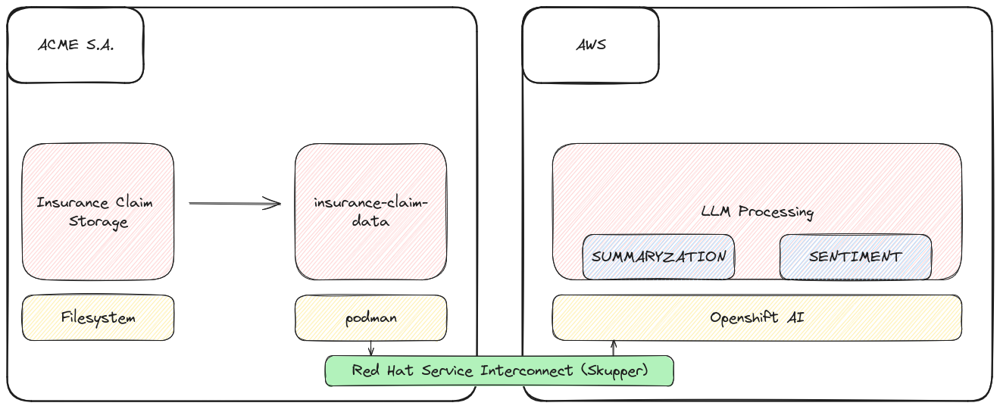
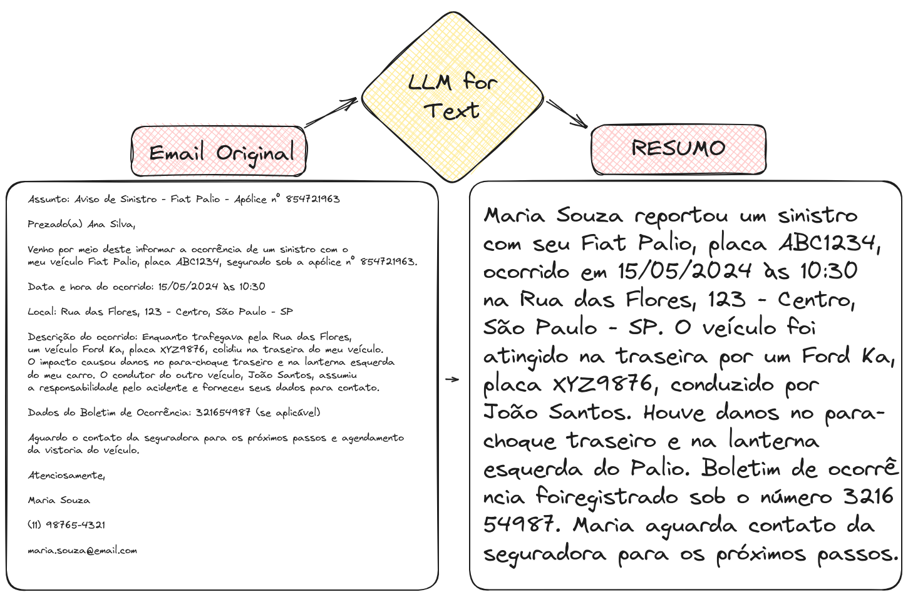
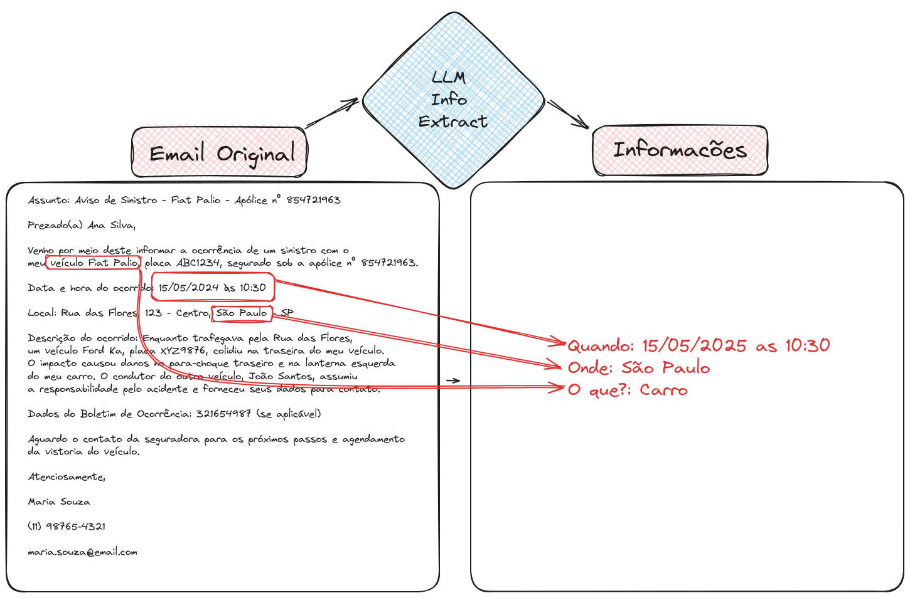
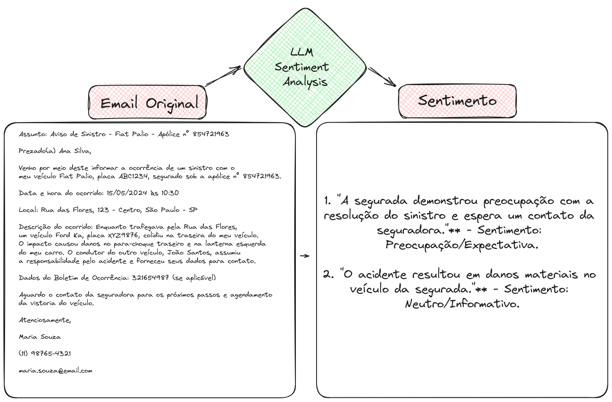
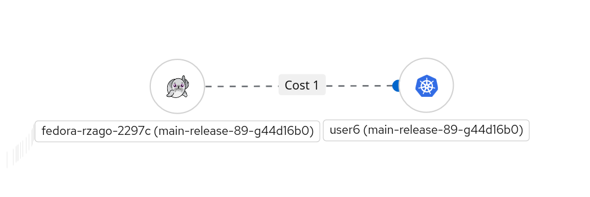
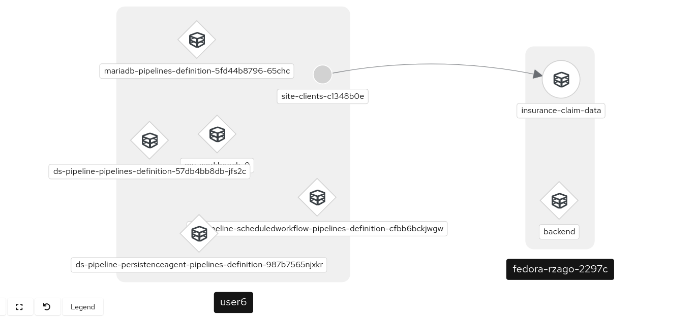

# Workshop - Insurance Claim Processing

## Workshop Overview


This lab will demonstrate how the combination of various Artificial Intelligence/Machine Learning (AI/ML) technologies can generate a valuable solution for a business problem. The information, code, models, and techniques presented illustrate how an initial prototype could be developed and do not represent the only way to meet the established requirements.

In addition to the training done for claims analysis as part of the Workshop at TDC Florianópolis, the example has been adapted to use **Skupper** as the connection for private insurance claim data. With this, the solution will be implemented as follows:

1. The storage of raw claim data will be done within the company, maintaining the confidentiality and control of the data.
2. A Go application will expose the internal data in a podman container with an endpoint for connection to Skupper. [go-flp](https://github.com/rafaelvzago/go-flp)
3. The environment for training AI/ML models will be set up in an Openshift AI cluster on AWS.
4. The connection between the podman data exposure service and the Openshift AI cloud environment will be done using Red Hat Service Interconnect (Skupper), which is a platform for hybrid and multicloud application integration that allows connecting applications and data in any environment, whether local, cloud, or container-based.

When using Skupper, we ensure a secure and efficient connection between local data and cloud-based AI/ML services, facilitating the creation of robust and scalable hybrid solutions.

Details:

1. This workshop is based on a demonstration of OpenShift AI, which provides a complete working environment for AI/ML projects.
2. Project repository: [Insurance Claim Processing](https://github.com/rh-aiservices-bu/insurance-claim-processing/tree/main)
3. Red Hat Service Interconnect: [Red Hat Service Interconnect](https://www.redhat.com/en/technologies/cloud-computing/service-interconnect)
4. Skupper: [Skupper](https://skupper.io/)
5. Go-flp: [go-flp](https://github.com/rafaelvzago/go-flp)

---

## The role of Skupper

Skupper is a platform for hybrid and multicloud application integration that allows connecting applications and data in any environment, whether local, cloud, or container-based. It provides a secure and efficient way to connect services and applications in different environments, enabling seamless and scalable communication between them.

In this workshop, Skupper is used to connect a local data service, which contains sensitive information about insurance claims, with a cloud-based AI/ML environment where the claims processing models are trained and executed. This secure and efficient connection allows data to be accessed and processed remotely while maintaining the integrity and security of the information.

### Details

- Security: To ensure data security, Skupper uses end-to-end encryption and certificate-based authentication to protect communication between services. (mTLS)
- Connectivity: The more open site (OpenShift AI) provides the entry service to the VAN, and the more closed site (podman) connects to the VAN.


## Process Structure

* Context
* Connection and Setup
* LLM for Text Summarization
* LLM for Information Extraction
* LLM for Sentiment Analysis

## Scenario

We are a large multinational insurance company undergoing digital transformation, seeking to modernize practices and utilize new technologies. A small team has been tasked with analyzing the current claims process and proposing improvements.

The findings will be presented to the board of directors, and if convincing, the team will receive resources to implement the recommendations. The next sections of this chapter present the materials that were presented to the board.

We have the need to integrate the claims processing solution with text analysis using our API in a Kubernetes cluster on AWS, as the processing was done within another company datacenter.

## Challenges:

### Using Skupper to Ensure Data Security and Integrity

1. **Maintaining data integrity and information security**:
    Skupper allows for the creation of hybrid and multicloud application networks, ensuring that communication between different environments is secure and reliable. By using Skupper, it is possible to encrypt all data traffic, ensuring that sensitive data is protected during transmission. Additionally, it maintains data integrity, preventing unauthorized changes and ensuring that the received data is the same as the sent data.

2. **Processing emails with OpenShift AI in the on-premises datacenter**:
    For email processing, Skupper can be configured to connect the company's internal infrastructure with the OpenShift AI cluster in the on-premises datacenter. This allows AI/ML models to be trained and executed locally, keeping the processing close to the data source and reducing latency. With Skupper, the company can leverage the advanced capabilities of OpenShift AI without exposing sensitive data to the public cloud.

3. **Keeping the application containing sensitive data, such as the original claims, within the company**:
    The application that stores sensitive data, such as the original claims, should remain within the company's infrastructure to ensure security and compliance with internal data protection policies. Skupper facilitates the secure connection of this application with other services or processing environments, ensuring that the data does not need to be moved outside the company.

4. **Ensuring secure connection between the data service and the datacenter**:
    Skupper uses secure communication tunnels to connect different environments, whether on-premises, in the cloud, or in containers. This ensures that the connection between the data service (stored within the company) and the datacenter (where OpenShift AI is located) is robust and protected against interceptions or unauthorized access. The use of Skupper provides secure and efficient communication, essential for maintaining the confidentiality and integrity of sensitive data.

In summary, Skupper is a crucial tool for ensuring that sensitive data is transmitted and processed securely between different environments, maintaining the integrity and security of the information. It enables the implementation of hybrid solutions that combine on-premises infrastructure and the cloud, leveraging the best of both worlds without compromising data security.


---
## Prototyping Work Examples

The examples below illustrate what we expect to achieve with the prototype version of the enhanced process.

### Using an LLM for Text Summarization

Allows for faster reading by the adjuster.


The image demonstrates how a language model (LLM) can summarize a long and confusing email from a customer about a car accident into a clear and concise format. This allows the insurance adjuster to quickly understand the key details of the accident (date, location, damages, witnesses), streamlining the analysis and processing of the claim.

### Using an LLM for Information Extraction

Allows for extracting key information from an email and automatically populating it.



The image demonstrates how a language model (LLM) can extract key information from an email about a car accident and automatically populate a structured form. In the example, the LLM correctly extracted the accident date, location, type of claim, and the sender's car model, saving time and reducing the risk of manual errors in incident registration.

## Prototyping Work Examples (Continued)

### Using an LLM for Sentiment Analysis

Allows for quickly identifying the customer's sentiment.



Detecting the tone of the text and potentially taking action based on it.


## How to Use LLMs?

- [Notebook for using LLM](https://github.com/rh-aiservices-bu/insurance-claim-processing/blob/main/lab-materials/03/03-01-nb-llm-example.ipynb)

This notebook demonstrates the programmatic interaction with a large-scale language model (LLM), such as ChatGPT, using Python and the Langchain framework. Through the Mistral-7B Instruct v2 model API, we set parameters and define a template to guide the model's responses. By combining the model and the template in Langchain, we create a conversation object to facilitate communication with the LLM, exemplified by a question about Artificial Intelligence. This programmatic method of interacting with LLMs offers opportunities to integrate language models into applications and systems, enabling the development of more personalized and efficient solutions.

### Text Summarization Notebook

- [Notebook for text summarization with LLM](https://github.com/rh-aiservices-bu/insurance-claim-processing/blob/main/lab-materials/03/03-02-summarization.ipynb)

The Python code in question prepares insurance claim data for summarization by a language model (LLM). It reads JSON files in the 'claims' folder, converts the content into Python dictionaries, and stores them in a larger claims dictionary. It uses the Langchain framework to create a summarization pipeline with the Mistral-7B Instruct v2 language model and a specific template. After creating the pipeline, the code iterates over each claim in claims, displaying the subject and original content of the claim, followed by the summary generated by the LLM, allowing for evaluation of the quality and usefulness of the model's summarization.

### Information Extraction Notebook

- [Notebook for information extraction with LLM](https://github.com/rh-aiservices-bu/insurance-claim-processing/blob/main/lab-materials/03/03-03-information-extraction.ipynb)

This notebook uses the Langchain framework and the Mistral-7B Instruct v2 language model to analyze texts and extract specific information, such as the author's sentiment and event details. An analysis pipeline is created with a specific template to guide the LLM. The code reads JSON files of insurance claims and, for each one, displays the subject and original content, queries the LLM for sentiment analysis, location extraction, and time extraction, and presents the analysis results.
### Notebook for LLM Model Comparison

- [Notebook for comparing LLM models](https://github.com/rh-aiservices-bu/insurance-claim-processing/blob/main/lab-materials/03/03-04-comparing-models.ipynb)

This notebook compares two language models (LLMs): Mistral-7B and Flan-T5-Small, evaluating their performance in text analysis tasks such as identifying the author's sentiment, location, and event time. Mistral-7B, with 7 billion parameters, requires a GPU with 24GB of RAM and provides more accurate and detailed results. In contrast, Flan-T5-Small, with 80 million parameters, can run without a GPU and with only 1GB of RAM, being faster but less precise.

In the analysis of a car claim, Mistral-7B correctly identified the positive sentiment, the exact location (intersection of Birch Street and Willow Avenue in Evergreen), and the time (January 2, 2024, at 3:30 PM). On the other hand, Flan-T5-Small provided inaccurate results, such as negative sentiment and incorrect information about the location and time. Choosing the ideal model should balance performance, accuracy, and available resources, with essential sanity checks to ensure that the model meets expectations and adapts to changes in the data.

## Part 2: Hands-On

### Activities


0. Install Skupper binary
1. Install Skupper locally
2. Install Skupper on the OpenShift Cluster
3. Linking the sites
4. Run the application inside the podman site and expose the service
5. Execute the workshop with modified examples [insurance-claim-processing-rafalvzago](https://github.com/rafaelvzago/insurance-claim-processing.git)


### Steps

0. Installing the Skupper binary

```bash
curl https://skupper.io/install.sh | sh
```

1. Installing Skupper on the podman site

```bash
export SKUPPER_PLATFORM=podman
podman network create skupper
skupper init --ingress none
```

2. Install Skupper on the OpenShift Cluster

```
skupper init --enable-console --enable-flow-collector --console-user admin --console-password admin
```

3. Linking the sites

* Creating the token on the most exposed cluster
    
    ```bash
    # skupper token create <token-name>
    skupper token create /tmp/insurance-claim
    ```
* Linking the podman site to the most exposed cluster
    
    ```bash
    # skupper link create <token-name> --name <site-name>
    skupper link create /tmp/insurance-claim --name ai
    ```

4. Running the application inside the podman site and exposing the service

### Running the application:

```bash
# podman run -d --network <network-name> -p <port>:<port> -v <volume with insurance claim files> --name <container-name> <image>
podman run -d --network skupper -p 8080:8080 -v /home/rzago/Code/go-flp/data:/app/data --name insurance-claim-data quay.io/rzago/insurance-claim-data:latest
```

### Creating the service in the podman site:

> In this step, the service is created in the podman site, and skupper will bind the service with the cluster service

```bash
# skupper service create <service-name> <port>
skupper service create backend 8080
```

> Binding the podman site service with the local service.


```bash
# skupper service bind <service-name> <target-name> --target-port <port>
skupper service bind backend host insurance-claim-data --target-port 8080
```

### Creating the service inside the cluster to expose the service to the OpenShift cluster.

```bash
# skupper service create <service-name> <port>
skupper service create backend 8080
```

### Successful connection



### Topology



### Testing the connection to the podman site service from the OpenShift cluster

```bash
❯ oc exec deploy/skupper-router -c router -- curl http://backend:8080/claim/claim1.json
  % Total    % Received % Xferd  Average Speed   Time    Time     Time  Current
                                 Dload  Upload   Total   Spent    Left  Speed
100  2352  100  2352    0     0   2900   {  0 --:--:-- --:--:-- --:--:--  2896
    "claim-number": 1,
    "subject": "Claim for Recent Car Accident - Policy Number: AC-987654321",
    "content": "Dear Pacific Shield Insurance,\n\nI hope this email finds you well. My name is Sarah Turner, and I am writing to file a claim for a recent car accident that occurred on January 2nd, 2024, at approximately 3:30 PM. My policy number is AC-987654321.\n\nThe accident took place at the intersection of Birch Street and Willow Avenue in the city of Evergreen. I was driving my vehicle, a black Toyota Camry with license plate number DEF-456, heading south on Birch Street. At the intersection, the traffic signal was green, and I proceeded through the intersection.\n\nAt the same time, another vehicle, a blue Chevrolet Traverse with license plate number GHI-789, was traveling west on Willow Avenue. Unfortunately, the driver failed to stop at the red traffic signal, resulting in a collision with the front passenger side of my vehicle.\n\nThe impact caused significant damage to both vehicles. The front bumper and right headlight of my Toyota Camry are extensively damaged, and there are also damages to the front driver's side of the Chevrolet Traverse. Fortunately, no injuries were sustained during the accident, and both drivers were able to move their vehicles to the side of the road.\n\nI promptly exchanged information with the other driver, Mr. Daniel Reynolds, including our names, phone numbers, insurance details, and a brief description of the accident. Additionally, I took photos of the accident scene, including the damages to both vehicles and the position of the traffic signal.\n\nI have attached the necessary documents to this email, including the photos, a copy of the police report filed at the Evergreen Police Department, and the estimate for the repair costs from Evergreen Auto Repair, where I have taken my vehicle for assessment.\n\nI kindly request your prompt attention to this matter and would appreciate any guidance on the next steps in the claims process. If you require any additional information or documentation, please do not hesitate to contact me at (555) 123-4567 or sarah.turner@email.com.\n\nThank you for your assistance, and I look forward to a swift resolution of this claim.\n\nSincerely,\n\nSarah Turner\n123 Oak Street\nEvergreen, CA 98765\n(555) 123-4567\nsarah.turner@email.com"
}
   0 --:--:-- --:--:-- --:--:--  2896
~
```
5. Continue with the workshop until generating the sentiments of the emails.


---

If you have any questions, please open an issue in the project repository.

Rafael Zago - [www.rafaelzago.com](https://www.rafaelzago.com)

License

Apache License 2.0

