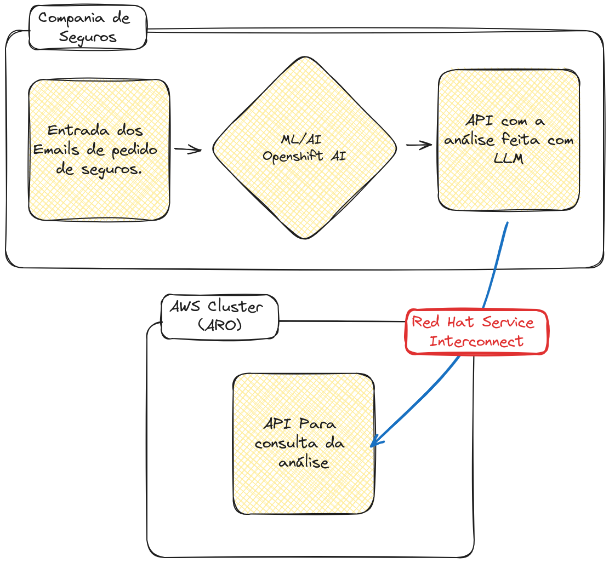
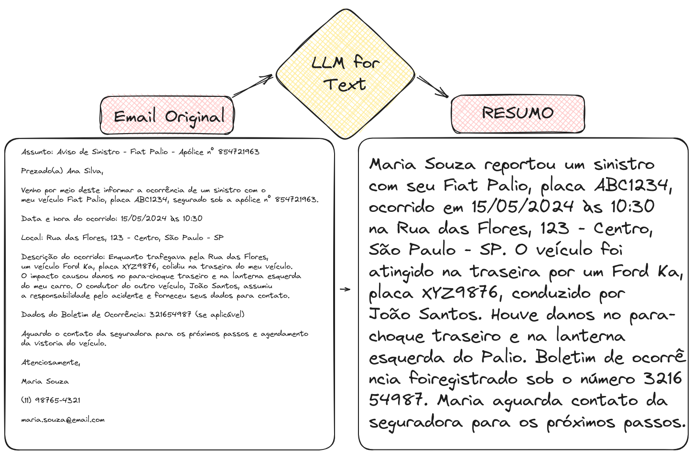
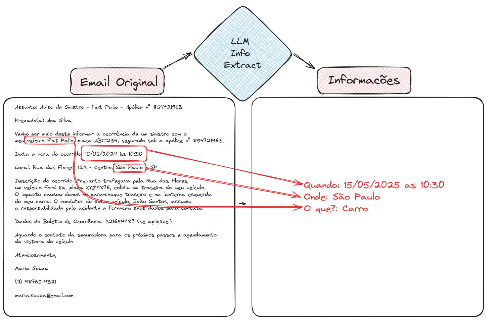
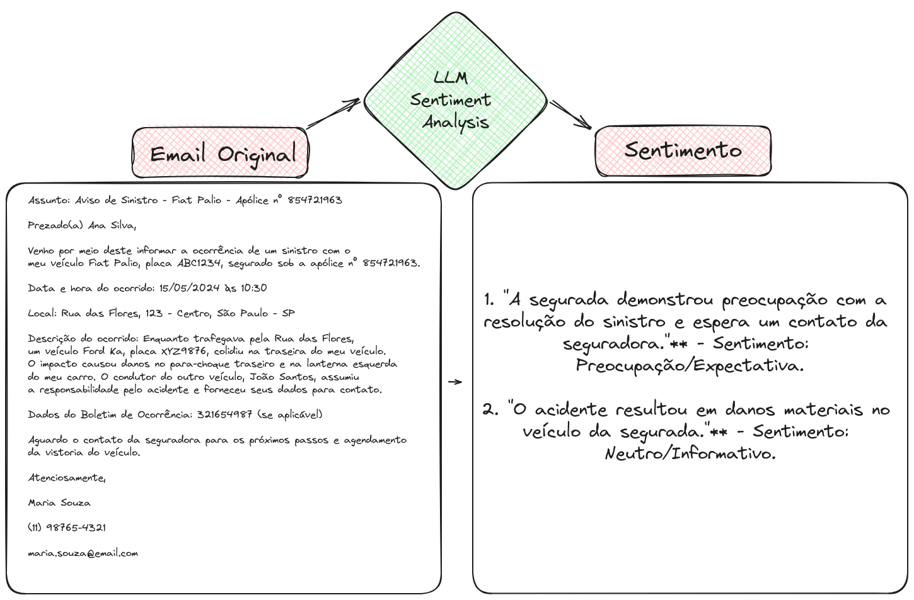

# Workshop - Processamento de Sinistros de Seguros

Link: https://demo.redhat.com/workshop/87caa7
Usuário: 
Senha: 

## Visão Geral do Workshop

Este laboratório demonstrará como a combinação de diversas tecnologias de Inteligência Artificial/Aprendizado de Máquina (IA/ML) pode gerar uma solução valiosa para um problema de negócio. As informações, códigos, modelos e técnicas apresentados ilustram como um primeiro protótipo poderia ser desenvolvido, e não representam a única forma de atender aos requisitos estabelecidos.

Além do treinamento feito para a análise dos sinistros, com parte do Workshop no TDC Florianópolis, o exemplo foi adaptado para utilizar o Skupper como conexão dos dados privados dos pedidos de seguros. Com isso, a solução será feita da seguinte forma:

1. O armazenamento dos dados brutos dos pedidos será feito dentro da empresa, mantendo o sigilo e controle dos dados.
2. Uma aplicação Go vai expor os dados internamente em um container podman com um endpoint para a conexão com o Skupper. [go-flp(https://github.com/rafaelvzago/go-flp)
3. O ambiente para treinamento dos modelos de IA/ML será feito em um cluster Openshift AI na AWS.
4. A conexão do serviço de exposição de dados podman com o ambiente em nuvem do Openshift AI será feita com o Red Hat Service Interconnect (Skupper), que é uma plataforma de integração de aplicativos híbridos e multicloud que permite conectar aplicativos e dados em qualquer ambiente, seja local, em nuvem ou em contêineres.

Detalhes:

1. Esse workshop se baseia em uma demonstração do OpenShift AI, que fornece um ambiente de trabalho completo para desenvolvimento de projetos de IA/ML.
2. Repositório do projeto: [Insurance Claim Processing](https://github.com/rh-aiservices-bu/insurance-claim-processing/tree/main)
3. Red Hat Service Interconnect: [Red Hat Service Interconnect](https://www.redhat.com/en/technologies/cloud-computing/service-interconnect)
4. Skupper: [Skupper](https://skupper.io/)
5. Go-flp: [go-flp](https://github.com/rafaelvzago/go-flp)




## Estrutura do Processo

* Contexto
* Conexão e Setup
* LLM           
* Processamento de Imagem 
* Web App         
* Produtização  

## Cenário

Somos uma grande seguradora multinacional em processo de transformação digital, buscando modernizar práticas e utilizar novas tecnologias. Uma pequena equipe foi incumbida de analisar o processo atual de sinistros e propor melhorias.

As descobertas serão apresentadas à diretoria e, se convincentes, a equipe receberá recursos para implementar as recomendações. As próximas seções deste capítulo apresentam os materiais que foram apresentados à diretoria.

Temos a necessidade de integrar a solução de processamento de sinistros com análise de texto com nossa API em um cluster Kubernetes na AWS, pois o processamento foi feito dentro de outro datacenter da empresa.


## Desafios:

1. Manter a integridade dos dados e a segurança da informação.
2. O processamento dos e-mails deve ser feito com o OpenShift AI no datacenter localizado dentro da empresa.
3. A aplicação contendo os dados sensíveis, como os claims originais, deve ser mantida dentro da empresa.
4. A conexão entre o serviço de dados e o datacenter deve ser segura.

## Análise do Processo Atual de Sinistros

Os sinistros podem ser recebidos por diversos canais (e-mail, fax, telefone, formulário web), mas todos precisam ser transcritos para o formulário web para padronização.

O processamento é feito por peritos (humanos), que levam em média 7 horas por sinistro. Estima-se que erros humanos causem perdas de US$ 2,5 milhões/ano, e fraudes, mais US$ 3,5 milhões/ano.

Existem muitas ineficiências, como a "fadiga por carga de trabalho", que leva os peritos a cometerem erros devido à natureza repetitiva do trabalho. Além disso, o treinamento de novos peritos nas políticas específicas da empresa é demorado.

Codificar parte desse conhecimento em um software é altamente desejável.

## Melhorias Propostas

**Recomendações:**

* Implementação progressiva e gradual.
* Utilizar ferramentas e técnicas de IA/ML para auxiliar os peritos (em vez de substituí-los completamente).
* Oferecer suporte para tarefas repetitivas e de baixo nível.
* Identificar áreas que precisam de revisão.
* Ajudar na análise e extração de dados.

**Objetivos:**

* Reduzir o tempo médio de processamento de 7h/sinistro para 2h/sinistro.
* Reduzir o erro humano em 80%.
* Melhorar a detecção de fraude em 25%.

**Requisitos:**

* Medir o desempenho com mais precisão, tanto no início quanto após cada mudança/melhoria.

## Exemplos do Trabalho de Prototipagem

Os exemplos abaixo ilustram o que esperamos alcançar com a versão protótipo do processo aprimorado.

### Utilizando um LLM para Resumo de Texto

Permite uma leitura mais rápida pelo perito.


 A imagem demonstra como um modelo de linguagem (LLM) pode resumir um e-mail longo e confuso de um cliente sobre um acidente de carro em um formato claro e conciso. Isso permite que o perito de seguros compreenda rapidamente os detalhes-chave do acidente (data, local, danos, testemunhas), agilizando o processo de análise e processamento da reivindicação.

### Utilizando um LLM para extração de informações

Permite extrair informações-chave de um e-mail e preencher automaticamente.



A imagem demonstra como um modelo de linguagem (LLM) pode extrair informações-chave de um e-mail sobre um acidente de carro e preencher automaticamente um formulário estruturado. No exemplo, o LLM extraiu corretamente a data do acidente, local, tipo de sinistro e modelo do carro do remetente, economizando tempo e reduzindo o risco de erros manuais no cadastro da ocorrência.

## Exemplos do Trabalho de Prototipagem (Continuação)

### Utilizando um LLM para Análise de Sentimento

Permite identificar rapidamente o sentimento do cliente.



Detectar o tom do texto e potencialmente agir sobre ele.

## Resultados

A diretoria foi convencida! A empresa decidiu financiar totalmente o projeto, permitindo a transição da fase de prototipagem para a produção. E a boa notícia é que vocês foram contratados para fazer parte da equipe que construirá e implementará a solução completa!


### Overview da Arquitetura

A imagem demonstra a arquitetura de um cluster de computação para processamento de dados e inteligência artificial. O cluster é composto por:

* **Recursos compartilhados:**
    - ic-shared-minio: Armazenamento de objetos (MinIO) para dados e artefatos.
    - ic-shared-app: Aplicativo compartilhado para interação com os usuários.
    - ic-shared-img-det: Modelos de detecção de imagem.
    - ic-shared-db: Banco de dados compartilhado.
    - ic-shared-llm: Modelos de linguagem de grande porte (LLMs) para processamento de linguagem natural.

* **Recursos individuais por usuário:**
    - Workbench: Ambiente de desenvolvimento para cada usuário (user1, user2, user3, ..., userN).
    - Model Serving: Serviço para disponibilizar modelos de machine learning.
    - Pipeline Server: Servidor para orquestrar pipelines de dados e machine learning.
    - Web App: Aplicativo web para interação com os usuários.

* **Infraestrutura:**
    - Vários nós de processamento com GPUs para execução de tarefas intensivas em computação.
    - Um nó de GPU dedicado para tarefas específicas.

A arquitetura permite que múltiplos usuários trabalhem em seus próprios projetos, utilizando recursos compartilhados e individuais, com o suporte de uma infraestrutura de computação poderosa.

## Como usar LLMs?

- [Notebook para utilizar LLM](https://github.com/rh-aiservices-bu/insurance-claim-processing/blob/main/lab-materials/03/03-01-nb-llm-example.ipynb)

Este notebook explora a interação programática com um modelo de linguagem de grande porte (LLM), como o ChatGPT, utilizando Python e o framework Langchain. Em vez de usar uma interface gráfica, acessamos o modelo Mistral-7B Instruct v2 diretamente através de sua API, aproveitando suas capacidades para tarefas específicas.

Configuramos o modelo com parâmetros como número máximo de tokens e temperatura, que influenciam o comprimento e a criatividade da resposta. Além disso, definimos um template com instruções detalhadas para guiar o comportamento do modelo, garantindo respostas seguras, éticas e informativas.

Utilizando o Langchain, combinamos o modelo e o template para criar um objeto de conversa, que facilita a comunicação com o LLM. Para demonstrar a interação, enviamos uma pergunta sobre Inteligência Artificial e obtivemos uma resposta detalhada e esclarecedora do modelo.

Este processo programático de interação com LLMs abre um leque de possibilidades para integrar modelos de linguagem em aplicações e sistemas, permitindo o desenvolvimento de soluções mais personalizadas e eficientes.

### Notebook para Resumo de Texto

- [Notebook para resumir texto com LLM](https://github.com/rh-aiservices-bu/insurance-claim-processing/blob/main/lab-materials/03/03-02-summarization.ipynb)

Este trecho de código em Python prepara os dados para a sumarização de sinistros por um modelo de linguagem (LLM). Ele lê todos os arquivos JSON na pasta 'claims', que contêm informações sobre sinistros de seguro. Em seguida, converte o conteúdo de cada arquivo em um dicionário Python e armazena esses dicionários em um dicionário maior chamado `claims`. Cada chave neste dicionário é o nome do arquivo JSON e o valor correspondente é o dicionário Python que representa o sinistro.

Em seguida, o código utiliza o framework Langchain para criar um pipeline de sumarização. Este pipeline combina o modelo de linguagem Mistral-7B Instruct v2 com um template que fornece instruções específicas para a tarefa de sumarização. O objetivo é gerar resumos concisos e informativos para cada sinistro presente nos arquivos JSON.

Após a criação do pipeline, o código itera sobre cada sinistro no dicionário `claims`. Para cada sinistro, ele exibe o assunto e o conteúdo original do sinistro, seguido do resumo gerado pelo LLM. Isso permite comparar o texto original com o resumo, avaliando a qualidade e a utilidade da sumarização realizada pelo modelo.


### Notebook para Extração de Informações

- [Notebook para extrair informações com LLM](https://github.com/rh-aiservices-bu/insurance-claim-processing/blob/main/lab-materials/03/03-03-information-extraction.ipynb)

Este notebook explora a capacidade de um LLM (Large Language Model) analisar textos e extrair informações específicas, como o sentimento do autor e detalhes sobre um evento.

Utilizando o framework Langchain e o modelo de linguagem Mistral-7B Instruct v2, um pipeline de análise é criado. Um template específico é definido para guiar o LLM na extração de informações relevantes, como o sentimento do autor, local e horário de um evento descrito em um texto.

O código lê arquivos JSON contendo exemplos de sinistros de seguro e, para cada sinistro:

1. Exibe o assunto e o conteúdo original da mensagem.
2. Realiza três consultas ao LLM:
    - Análise de sentimento: Detecta o estado emocional do autor da mensagem.
    - Extração de local: Identifica o local do evento mencionado na mensagem.
    - Extração de tempo: Determina o horário (data e hora) do evento mencionado na mensagem.
3. Apresenta os resultados da análise, incluindo o sentimento, local e horário extraídos.

Essa demonstração ilustra como os LLMs podem ser utilizados para automatizar a análise de textos, extraindo informações relevantes de forma rápida e eficiente, o que pode ser aplicado em diversas áreas, como análise de feedback de clientes, moderação de conteúdo e processamento de documentos.

### Notebook para comparação de modelos de LLMs

- [Notebook para comparar modelos de LLMs](https://github.com/rh-aiservices-bu/insurance-claim-processing/blob/main/lab-materials/03/03-04-comparing-models.ipynb)

Este notebook explora a comparação entre dois modelos de linguagem (LLMs): Mistral-7B e Flan-T5-Small, avaliando seu desempenho em tarefas de análise de texto, como identificar o sentimento do autor, local e horário de um evento.

**Comparação dos Modelos:**

* **Mistral-7B:**
    - Modelo maior com 7 bilhões de parâmetros.
    - Requer GPU com 24GB de RAM.
    - Apresenta resultados mais precisos e detalhados na análise do texto.
* **Flan-T5-Small:**
    - Modelo menor com 80 milhões de parâmetros.
    - Executa sem GPU e com apenas 1GB de RAM.
    - Mais rápido, mas com resultados menos precisos e detalhados.

**Análise de Caso:**

> O notebook demonstra a análise de um sinistro de carro utilizando ambos os modelos. O Mistral-7B identifica corretamente o sentimento positivo do remetente, o local (cruzamento de Birch Street e Willow Avenue em Evergreen) e o horário (2 de janeiro de 2024, às 15h30). Já o Flan-T5-Small apresenta resultados imprecisos, como um sentimento negativo e informações incorretas sobre o local e o horário.

**Conclusão:**

> A escolha do modelo ideal depende do equilíbrio entre desempenho, precisão e recursos disponíveis. O Mistral-7B oferece maior precisão, mas exige mais recursos. O Flan-T5-Small é mais rápido e leve, porém menos preciso. É crucial realizar verificações de sanidade para garantir que o modelo escolhido atenda às expectativas e se adapte às mudanças nos dados.

### Modificando os parâmetros do LLM

#### Explorando as Configurações e Modificando os Dados

Para entender melhor o comportamento dos modelos de linguagem (LLMs), vamos experimentar com suas configurações e dados.

**Ajustando as Configurações do LLM:**

1. **Notebook 03-01-nb-llm-example.ipynb:**
   - Modifique parâmetros como a temperatura para respostas mais criativas.
   - Experimente com o template do prompt para obter respostas em diferentes formatos (poemas, explicações para públicos específicos).
   - Altere as perguntas para testar a robustez contra "prompt injection".

**Modificando os Dados e o Prompt:**

2. **Notebook 03-02-summarization.ipynb:**
   - Edite ou crie sinistros mais complexos.
   - Experimente com diferentes idiomas.
3. **Notebook 03-03-information-extraction.ipynb:**
   - Edite ou crie sinistros mais complexos.
   - Ajuste o prompt para extração de data e hora mais precisa, em formato específico.

## Parte 2: Hands On

### Atividades

1. Instalar o Skupper localmente
2. Instalar o Skupper no Cluster OpenShift
3. Fazer o link dos sites
4. Rodando a aplicação dentro do podman site e expondo o serviço
5. Modificar os exemplos usados na demonstração

1. Instalando o Skupper no podman site

```bash
export SKUPPER_PLATFORM=podman
podman network create skupper
./skupper init --ingress none
```

2. Instalar o Skupper no Cluster OpenShift

```
./skupper init --enable-console --enable-flow-collector --console-user admin --console-password admin
```

3. Fazendo o Link entre os sites

* Criando o token no cluster mais exposto
    
    ```bash
    # skupper token create <token-name>
    ./skupper token create insurance-claim
    ```
* Fazendo o link do site podman no cluster mais exposto
    
    ```bash
    # skupper link create <token-name> --name <site-name>
    ./skupper link create insurance-claim --name ai
    ```

4. Rodando a aplicação dentro do podman site e expondo o serviço

#### Rodando a aplicação:

```bash
# podman run -d --network <network-name> -p <port>:<port> -v <volume com os arquivos dos pedidos de seguro> --name <container-name> <image>
podman run -d --network skupper -p 8080:8080 -v /home/rzago/Code/go-flp/data:/app/data --name insurance-claim-data quay.io/rzago/insurance-claim-data:latest
```

##### Criando o serviço no podman site:

> Nesse passo, o serviço é criado no podman site e o skupper vai fazer o bind do serviço com o serviço do cluster

```bash
# skupper service create <service-name> <port>
./skupper service create backend 8080
```

> Fazendo o Bind do serviço podman site com o serviço local.


```bash
# skupper service bind <service-name> <target-name> --target-port <port>
./skupper service bind backend host insurance-claim-data --target-port 8080
```

##### Criando o serviço dentro do cluster, para expor o serviço para o cluster Openshift.

```bash
# skupper service create <service-name> <port>
./skupper service create backend 8080
```

5. Modificar os exemplos usados na demonstração

* Utilizar os notebooks modificados